# Лабораторная работа 2. Однослойный перцептрон

Тема работы: реализация, обучение и анализ однослойного перцептрона для бинарной классификации.

## Цель работы

- Реализовать алгоритм обучения однослойного перцептрона с нуля, без готовых библиотек глубокого обучения.
- Изучить влияние гиперпараметров на обучение: скорость обучения, количество эпох, размер батча.
- Научиться подготавливать данные для нейронных сетей: стратификация и Z-score стандартизация.
- Провести анализ результатов и сделать выводы.

## Используемые библиотеки

В работе используются:

- `NumPy` - векторные вычисления, градиенты, генерация данных;
- `Matplotlib` - построение графиков;
- `scikit-learn` - только для генерации базового набора данных и стратифицированного разбиения.

Готовые модели машинного обучения не используются. Перцептрон, функции потерь, метрики, ROC-AUC, кросс-валидация и momentum реализованы вручную.

## Запуск

```bash
pip install -r requirements.txt
python main.py
```

После запуска все таблицы, графики и текстовые выводы сохраняются в папку `results/`.

## Структура проекта

- `main.py` - основной запуск всех экспериментов.
- `config.py` - общие параметры: seed, количество эпох, learning rate, batch size.
- `data.py` - подготовка данных: генерация, train/test split, стандартизация.
- `model.py` - реализация класса `Perceptron`.
- `metrics.py` - accuracy, precision, recall, F1-score, ROC-AUC.
- `experiments.py` - обязательные и дополнительные эксперименты.
- `synthetic_data.py` - собственный генератор данных для доп. задания 1.
- `visualization.py` - построение графиков.
- `utils.py` - сохранение таблиц и вывод результатов.

## Теория

### Модель перцептрона

Для объекта с двумя признаками модель вычисляет линейную комбинацию:

$$
z = w^T x + b = w_1x_1 + w_2x_2 + b
$$

Затем значение пропускается через сигмоидную функцию:

$$
\hat{y} = \sigma(z) = \frac{1}{1 + e^{-z}}
$$

Выход `ŷ` лежит в интервале `(0, 1)` и интерпретируется как вероятность класса `1`. Для получения итогового класса используется порог `0.5`:

$$
\hat{c} =
\begin{cases}
1, & \hat{y} \ge 0.5 \\
0, & \hat{y} < 0.5
\end{cases}
$$

Разделяющая граница задается прямой:

$$
w^Tx + b = 0
$$

### Binary cross-entropy

Основная функция потерь:

$$
L = -\frac{1}{m}\sum_{i=1}^{m}
\left[y_i\log(\hat{y_i}) + (1-y_i)\log(1-\hat{y_i})\right]
$$

Чем ближе предсказание к правильной метке, тем меньше loss. Если модель уверенно ошибается, значение функции потерь резко растет.

### Градиенты

Для кросс-энтропии вместе с сигмоидой градиенты имеют простой вид:

$$
\frac{\partial L}{\partial w} = \frac{1}{m}X^T(\hat{y} - y)
$$

$$
\frac{\partial L}{\partial b} = \frac{1}{m}\sum_{i=1}^{m}(\hat{y_i} - y_i)
$$

Параметры обновляются по правилу градиентного спуска:

$$
w \leftarrow w - \eta \frac{\partial L}{\partial w}
$$

$$
b \leftarrow b - \eta \frac{\partial L}{\partial b}
$$

где `η` - скорость обучения.

### Стандартизация

Признаки стандартизируются по обучающей выборке:

$$
x' = \frac{x - \mu}{\sigma}
$$

Среднее `μ` и стандартное отклонение `σ` вычисляются только на train. Затем эти же значения применяются к test. Это нужно, чтобы не допустить утечки информации из тестовой выборки.

## Обязательная часть

### Подготовка данных

Базовый набор данных сгенерирован через `make_classification`:

- `n_samples = 500`
- `n_features = 2`
- `n_informative = 2`
- `n_redundant = 0`
- `n_clusters_per_class = 1`
- `random_state = 42`

Данные разделены на train/test в пропорции `70/30` со стратификацией. После этого признаки стандартизированы по обучающей выборке.

### Базовое обучение

Параметры базовой модели:

- `learning_rate = 0.1`
- `epochs = 100`
- `batch_size = 32`
- инициализация весов: малые случайные значения

| Train accuracy | Test accuracy | Train loss | Test loss |
|---:|---:|---:|---:|
| 0.8657 | 0.8867 | 0.330933 | 0.302918 |

График функции потерь:

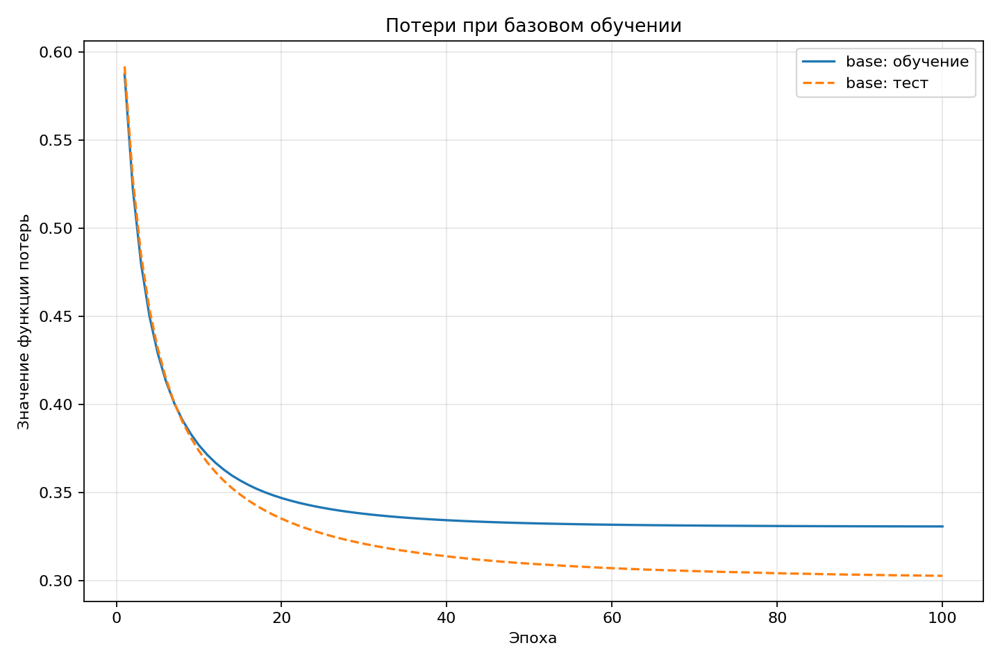

Разделяющая граница:

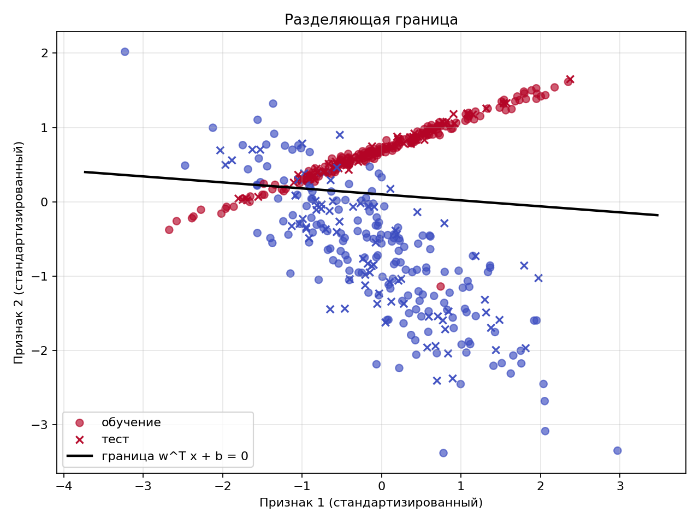

По графику loss видно, что ошибка быстро уменьшается в начале обучения, затем выходит на плато. Разделяющая граница является прямой, поэтому модель хорошо работает только там, где классы можно отделить линейно.

## Влияние гиперпараметров

### Скорость обучения

| Learning rate | Train accuracy | Test accuracy | Train loss | Test loss |
|---:|---:|---:|---:|---:|
| 0.001 | 0.8571 | 0.8800 | 0.588569 | 0.593025 |
| 0.01 | 0.8600 | 0.8867 | 0.377303 | 0.374141 |
| 0.5 | 0.8657 | 0.8867 | 0.330795 | 0.300873 |
| 1.0 | 0.8686 | 0.8867 | 0.330831 | 0.300641 |

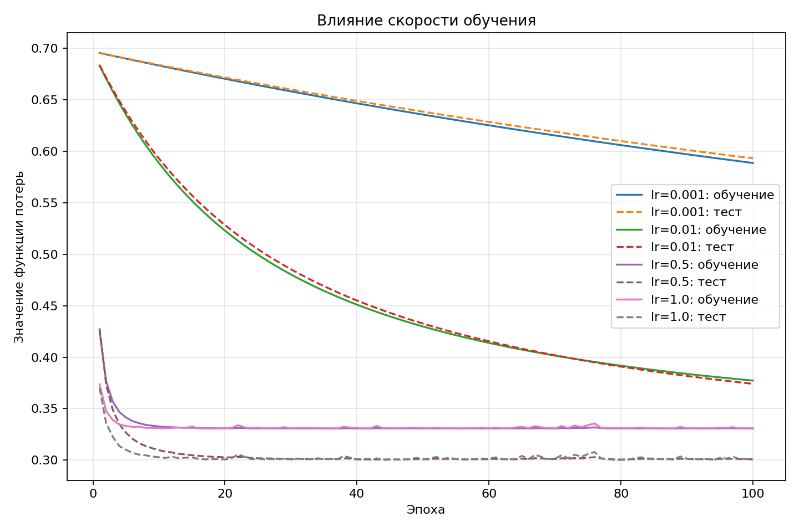

Маленькая скорость обучения `0.001` сходится медленно: loss остается высоким. При `0.01` обучение уже заметно лучше. Значения `0.5` и `1.0` дают меньший loss и похожую точность, то есть на данном наборе данных модель устойчива к достаточно большому шагу.

### Количество эпох

| Epochs | Train accuracy | Test accuracy | Train loss | Test loss |
|---:|---:|---:|---:|---:|
| 10 | 0.8600 | 0.8867 | 0.376981 | 0.373761 |
| 50 | 0.8686 | 0.8867 | 0.332769 | 0.309826 |
| 100 | 0.8657 | 0.8867 | 0.330933 | 0.302918 |
| 200 | 0.8657 | 0.8867 | 0.330797 | 0.301128 |

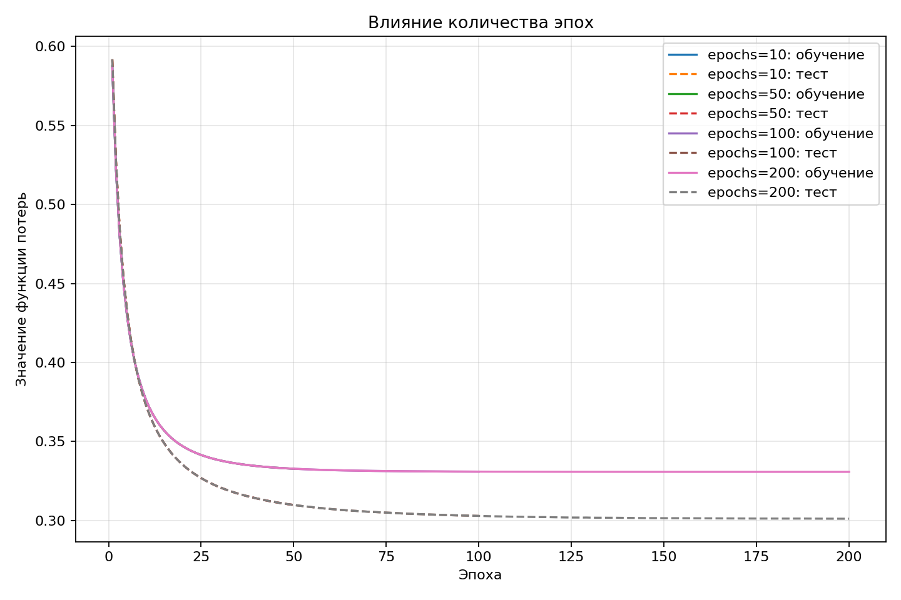

С увеличением количества эпох loss уменьшается. При этом accuracy почти не меняется, потому что модель уже достаточно рано находит похожую разделяющую границу. После 100 эпох улучшение становится минимальным.

### Размер батча

| Batch size | Train accuracy | Test accuracy | Train loss | Test loss |
|---:|---:|---:|---:|---:|
| 1 | 0.8657 | 0.8867 | 0.331237 | 0.300196 |
| 16 | 0.8657 | 0.8867 | 0.330801 | 0.301116 |
| 64 | 0.8629 | 0.8867 | 0.332379 | 0.308924 |
| 256 | 0.8600 | 0.8867 | 0.349787 | 0.339309 |

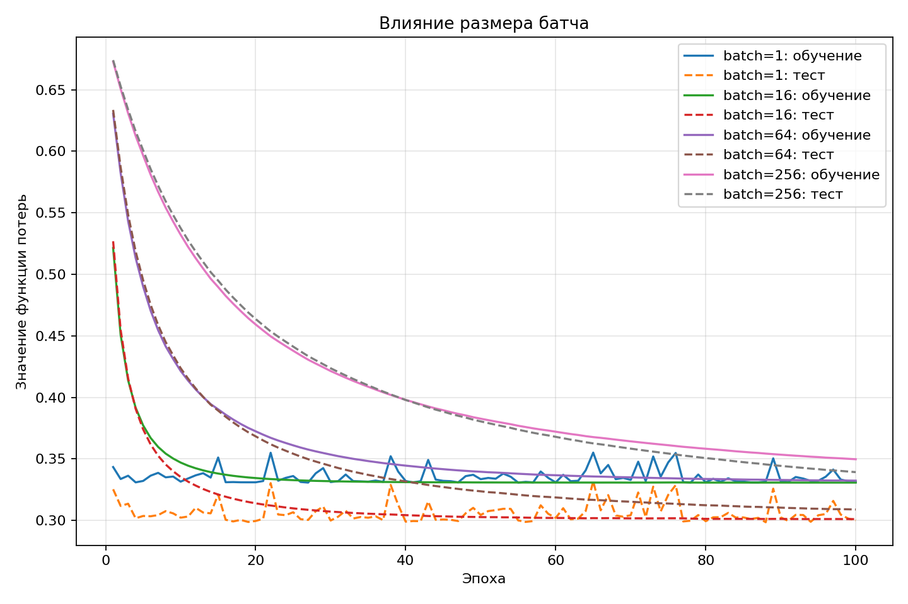

Малые батчи дают больше обновлений за эпоху и быстрее уменьшают loss. Большой batch size `256` делает меньше обновлений и сходится медленнее.

### Инициализация весов

| Initialization | Train accuracy | Test accuracy | Train loss | Test loss |
|---|---:|---:|---:|---:|
| zero | 0.8657 | 0.8867 | 0.330933 | 0.302916 |
| small random | 0.8657 | 0.8867 | 0.330933 | 0.302918 |
| large random | 0.8657 | 0.8867 | 0.331083 | 0.303881 |

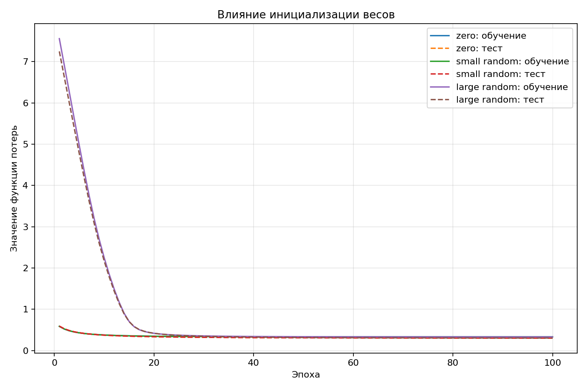

Для однослойной модели с двумя признаками все варианты дали близкое качество. Большие случайные веса могут ухудшать старт обучения, потому что сигмоида быстрее попадает в насыщение, но на данном наборе данных модель все равно сходится.

## Дополнительное задание 1. Собственный генератор данных

Реализованы три генератора:

- линейно разделимые гауссовы облака;
- XOR;
- окружность: точки внутри и снаружи круга;
- шум: переворот метки с вероятностью `p`.

| Dataset | Train accuracy | Test accuracy | Train loss | Test loss |
|---|---:|---:|---:|---:|
| linear | 0.9857 | 1.0000 | 0.092514 | 0.024272 |
| xor | 0.4943 | 0.4867 | 0.691508 | 0.699393 |
| circle | 0.4829 | 0.4733 | 0.690594 | 0.697757 |

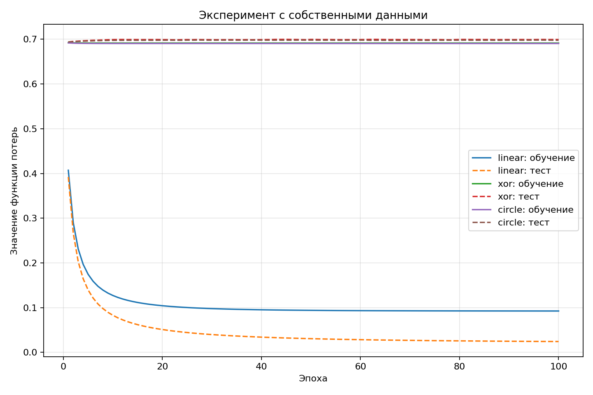

Линейно разделимые данные:

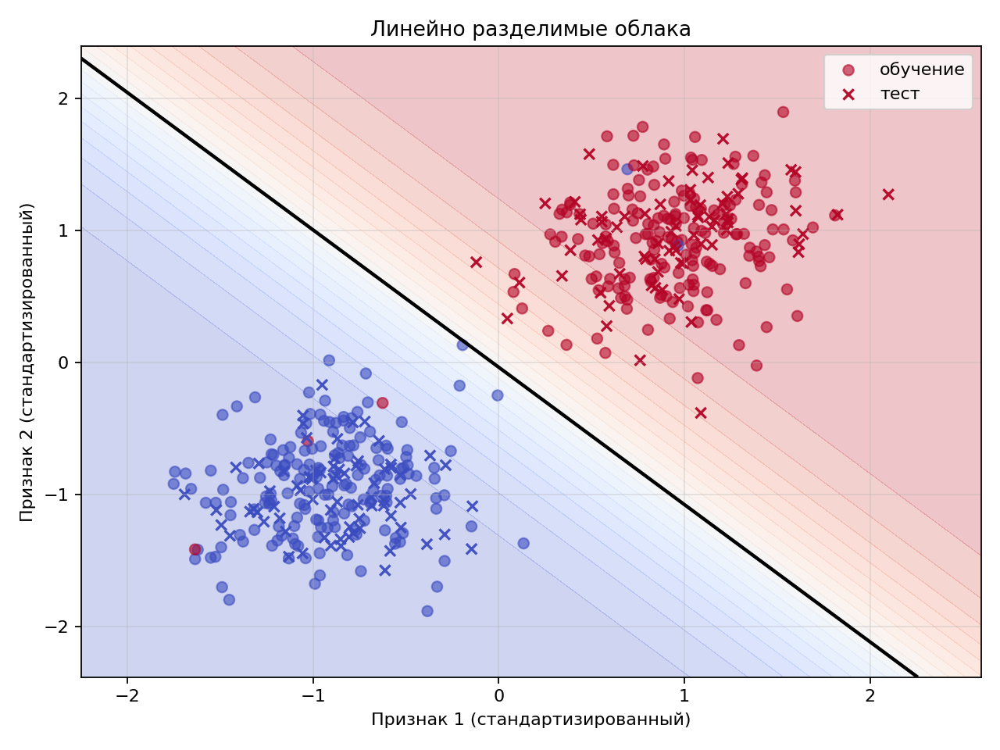

XOR:

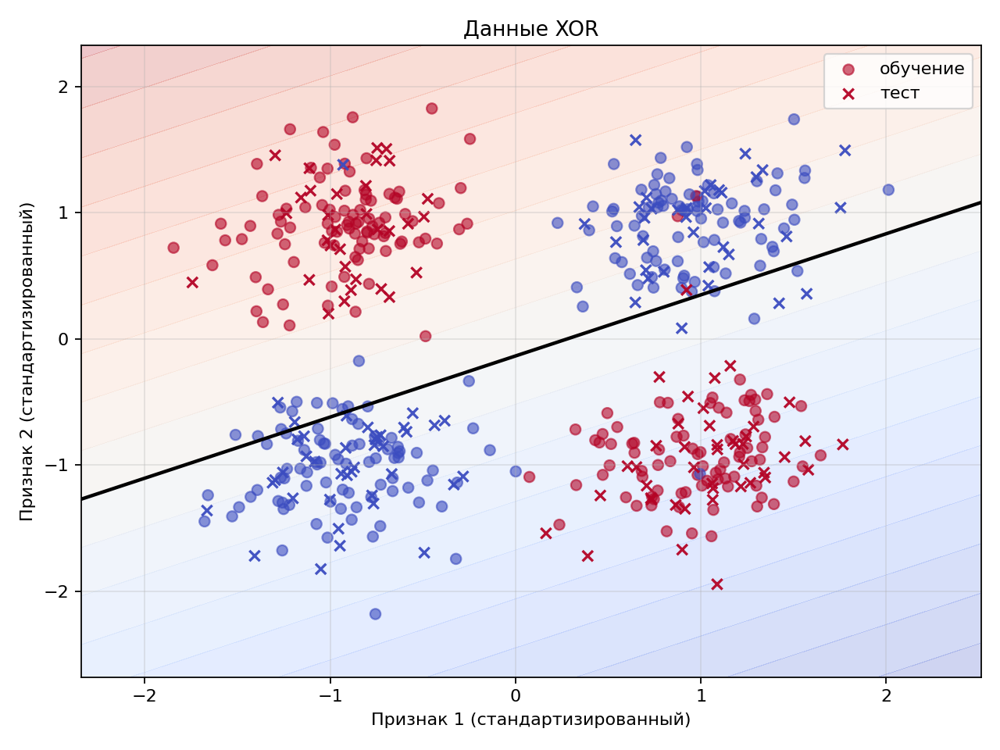

Окружность:

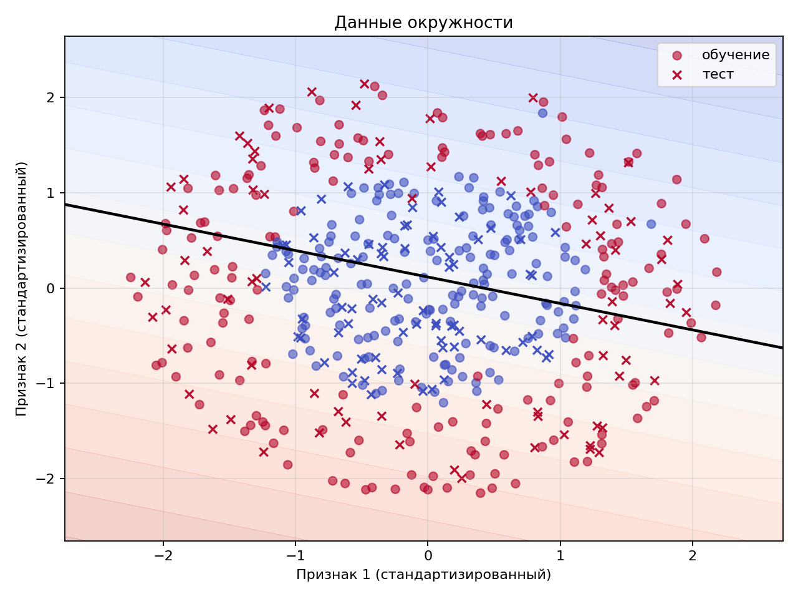

Вывод: однослойный перцептрон строит линейную границу. Поэтому он успешно классифицирует линейно разделимые данные, но не справляется с XOR и окружностью, где нужна нелинейная граница.

## Дополнительное задание 2. Hinge loss и L2-регуляризация

### Hinge loss

Для hinge loss метки переводятся из `{0, 1}` в `{-1, +1}`.

Функция потерь:

$$
L = \frac{1}{m}\sum_{i=1}^{m}\max(0, 1 - y_i(w^Tx_i + b))
$$

| Loss | Train accuracy | Test accuracy | Train loss | Test loss | Convergence epoch | Weight norm |
|---|---:|---:|---:|---:|---:|---:|
| cross entropy | 0.8657 | 0.8867 | 0.330933 | 0.302918 | 23 | 3.151130 |
| hinge loss | 0.9000 | 0.9200 | 0.317555 | 0.300655 | 11 | 2.469623 |

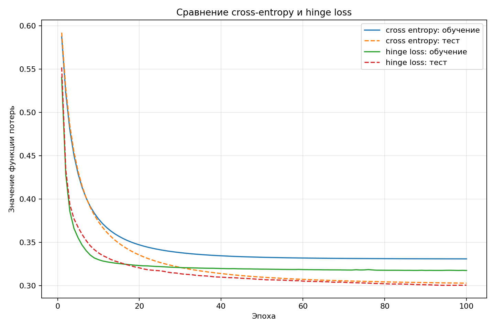

Hinge loss в этом эксперименте сошелся быстрее по условному критерию и дал выше accuracy. Но значения hinge loss и cross-entropy нельзя напрямую сравнивать по масштабу, потому что это разные функции потерь.

### L2-регуляризация

К cross-entropy добавлен штраф за большие веса:

$$
L_{reg} = L + \frac{\lambda}{2}\|w\|^2
$$

Градиент по весам:

$$
\frac{\partial L_{reg}}{\partial w}
= \frac{\partial L}{\partial w} + \lambda w
$$

| Lambda | Train accuracy | Test accuracy | Weight norm |
|---:|---:|---:|---:|
| 0.0 | 0.8657 | 0.8867 | 3.151130 |
| 0.001 | 0.8657 | 0.8867 | 3.057590 |
| 0.01 | 0.8629 | 0.8867 | 2.484123 |
| 0.1 | 0.8600 | 0.8867 | 1.212337 |
| 1.0 | 0.8514 | 0.8800 | 0.289089 |

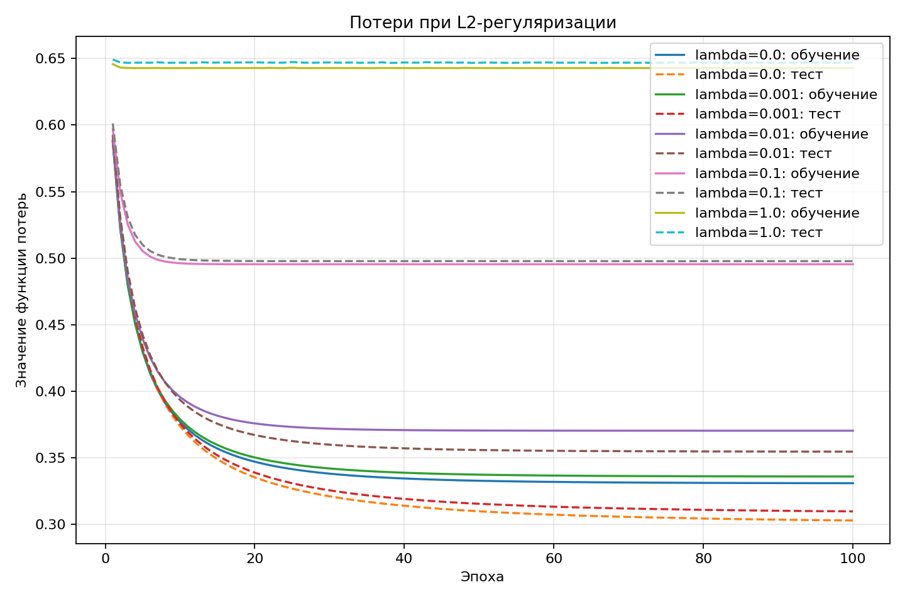

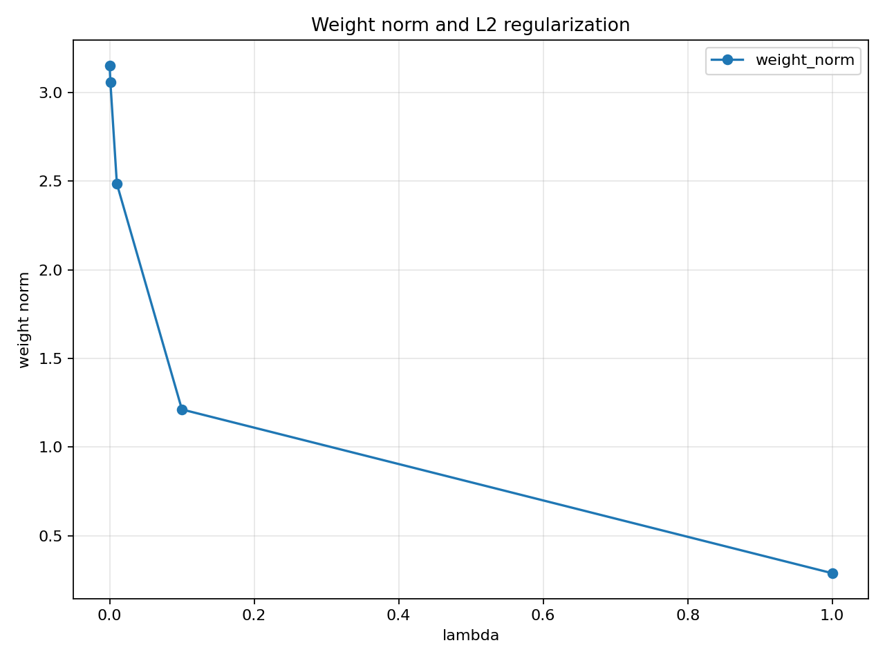

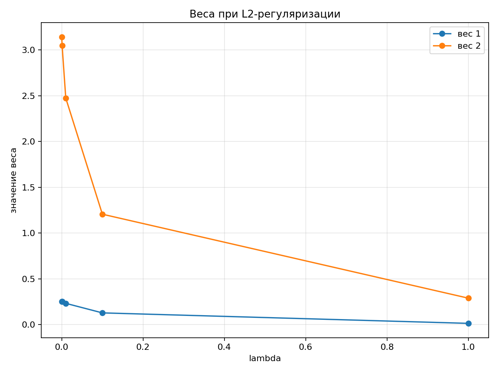

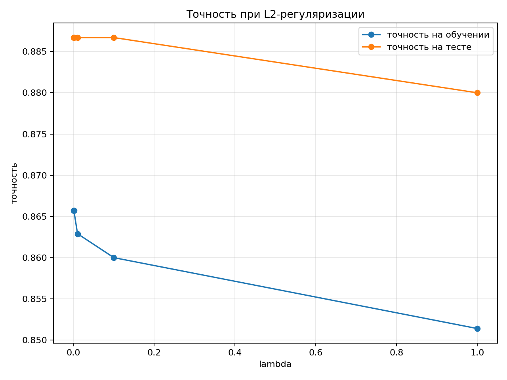

При росте `lambda` норма весов уменьшается. Слишком сильная регуляризация ограничивает модель слишком жестко, поэтому при `lambda = 1.0` качество немного падает.

## Дополнительное задание 3. Метрики качества и анализ ошибок

Метрики на тестовой выборке:

| Accuracy | Precision | Recall | F1-score | ROC-AUC | Errors |
|---:|---:|---:|---:|---:|---:|
| 0.8867 | 0.8537 | 0.9333 | 0.8917 | 0.9413 | 17 |

Формулы:

$$
Accuracy = \frac{TP + TN}{TP + TN + FP + FN}
$$

$$
Precision = \frac{TP}{TP + FP}
$$

$$
Recall = \frac{TP}{TP + FN}
$$

$$
F1 = 2\cdot\frac{Precision\cdot Recall}{Precision + Recall}
$$

ROC-кривая показывает зависимость `TPR` от `FPR` при разных порогах классификации.

$$
TPR = \frac{TP}{TP + FN}
$$

$$
FPR = \frac{FP}{FP + TN}
$$

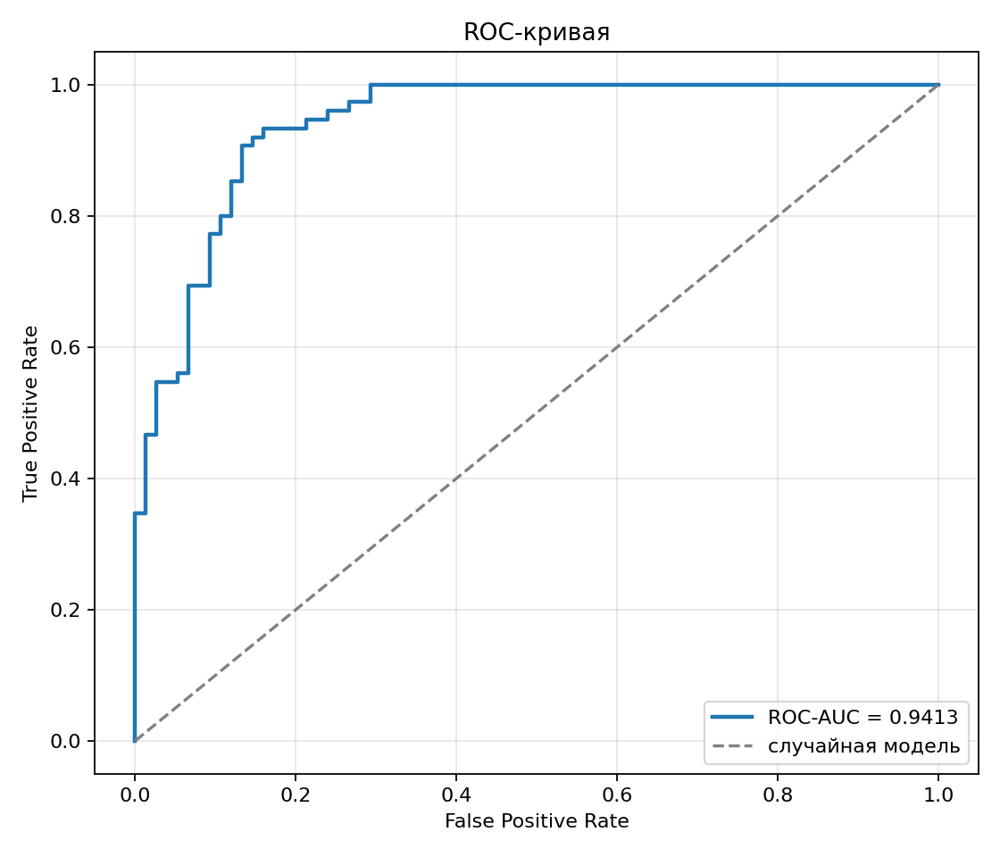

Ошибочно классифицированные точки:

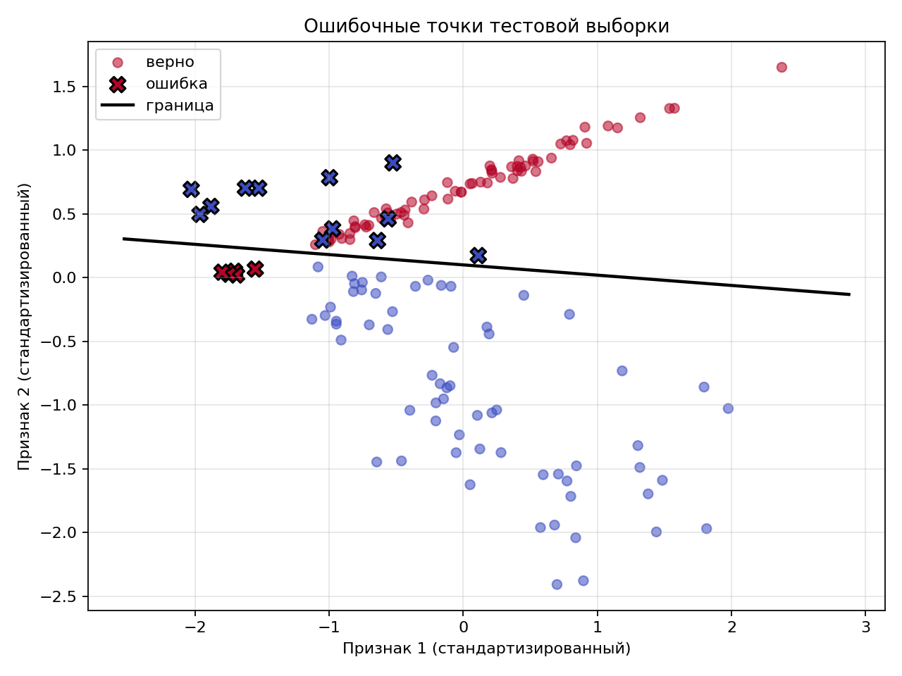

Большая часть ошибок находится рядом с разделяющей прямой или в области пересечения классов. Это ожидаемо: в таких местах линейной модели сложнее уверенно выбрать правильный класс.

## Дополнительное задание 4. Momentum

Momentum добавляет накопление направления предыдущих градиентов:

$$
v_t = \beta v_{t-1} + \nabla L(w_t)
$$

$$
w_{t+1} = w_t - \eta v_t
$$

| Method | Beta | Test accuracy | Train loss | Test loss | Convergence epoch |
|---|---:|---:|---:|---:|---:|
| SGD | 0.0 | 0.8867 | 0.330933 | 0.302918 | 23 |
| beta=0.5 | 0.5 | 0.8867 | 0.330808 | 0.301209 | 13 |
| beta=0.9 | 0.9 | 0.8867 | 0.330857 | 0.301320 | 3 |
| beta=0.99 | 0.99 | 0.8867 | 0.331210 | 0.301206 | 39 |

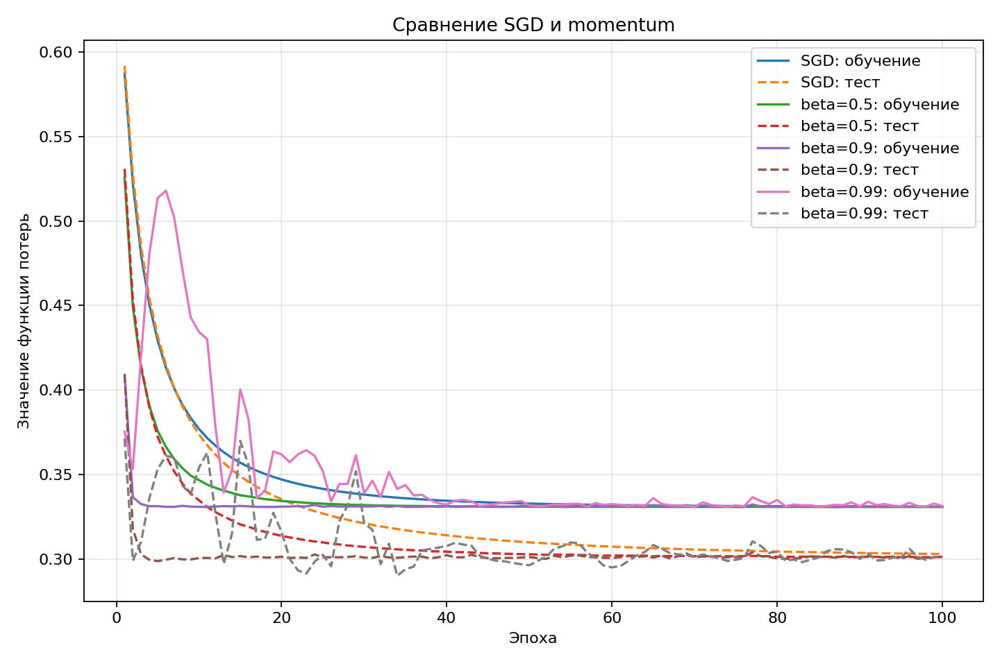

В этом эксперименте `beta = 0.9` ускорил обучение сильнее всего. При `beta = 0.99` импульс оказался слишком большим: обучение стало менее стабильным и условная сходимость заняла больше эпох.

## Дополнительное задание 5. Кросс-валидация

Реализована 5-кратная стратифицированная кросс-валидация для подбора:

- скорости обучения `η`;
- размера батча.

Лучшие параметры:

| Learning rate | Batch size | Mean accuracy | Std accuracy |
|---:|---:|---:|---:|
| 0.5 | 32 | 0.8658 | 0.0209 |

Финальная модель обучена на всех обучающих данных с выбранными параметрами:

| Learning rate | Batch size | Train accuracy | Test accuracy | Train loss | Test loss |
|---:|---:|---:|---:|---:|---:|
| 0.5 | 32 | 0.8657 | 0.8867 | 0.330795 | 0.300873 |

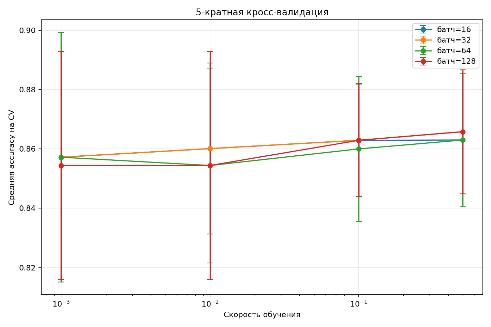

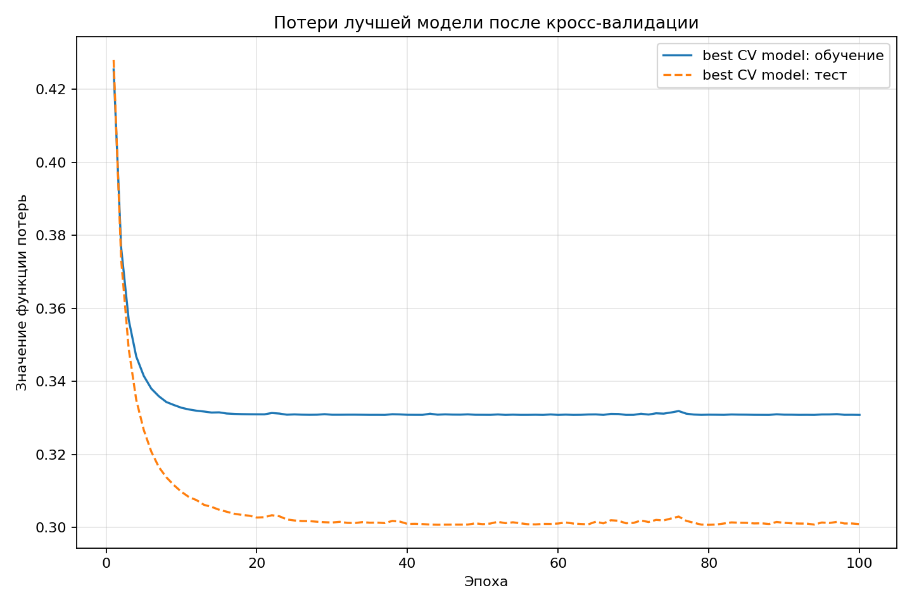

Кросс-валидация позволяет выбирать гиперпараметры не по одному случайному разбиению, а по среднему качеству на нескольких фолдах. Это делает оценку устойчивее.

## Общий вывод

В работе реализован однослойный перцептрон с нуля. Модель обучается мини-батчевым градиентным спуском, использует сигмоиду и binary cross-entropy. Были исследованы скорость обучения, количество эпох, размер батча, инициализация весов, разные функции потерь, L2-регуляризация, momentum и подбор гиперпараметров через кросс-валидацию.

Главный результат: однослойный перцептрон хорошо подходит для линейно разделимых задач, но не может построить сложную нелинейную границу для XOR или окружности. Для таких данных нужны дополнительные признаки, ядровые методы или многослойная нейронная сеть.
